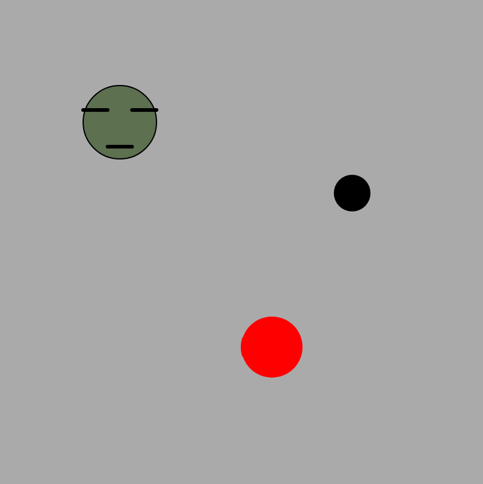

# Hitting Puck

Juna Kim

[View this project online](https://june2174.github.io/CART253/Challenges/Conditionals/conditionals%20challenge/)

## Description

*Hitting Puck* has three elements, Usercircle, Puckcircle, and Targetcircle. Usercircle moves by your mouse cursor so if you hit the Puck with user circle, puck will move. I gave velocity and force to the puck so it actually moves like a real puck. Plus I set the boundaries(Canvas size) so puck can't go out of the canvas. Targetcircle stays still. It's initial color is dark green with disappointed face but if puck hits the target, the color changes into yellow and it smiles. To differ facial expressions, I put the checkTarget function(which checks the overlapping of target and puck) in the drawTarget Function. (That's why  there's no checkTarget function in draw Function fyi)

## Screenshot(s)

## Attribution

- This project uses [p5.js](https://p5js.org)
- The velocity references [Reference](https://editor.p5js.org/p5/sketches/Motion:_Circle_Collision)
