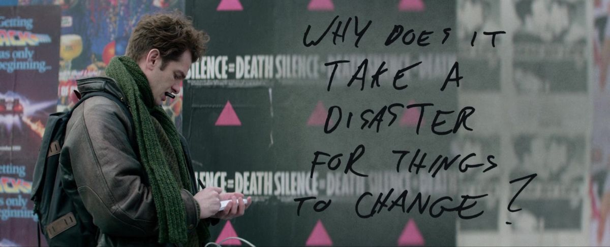
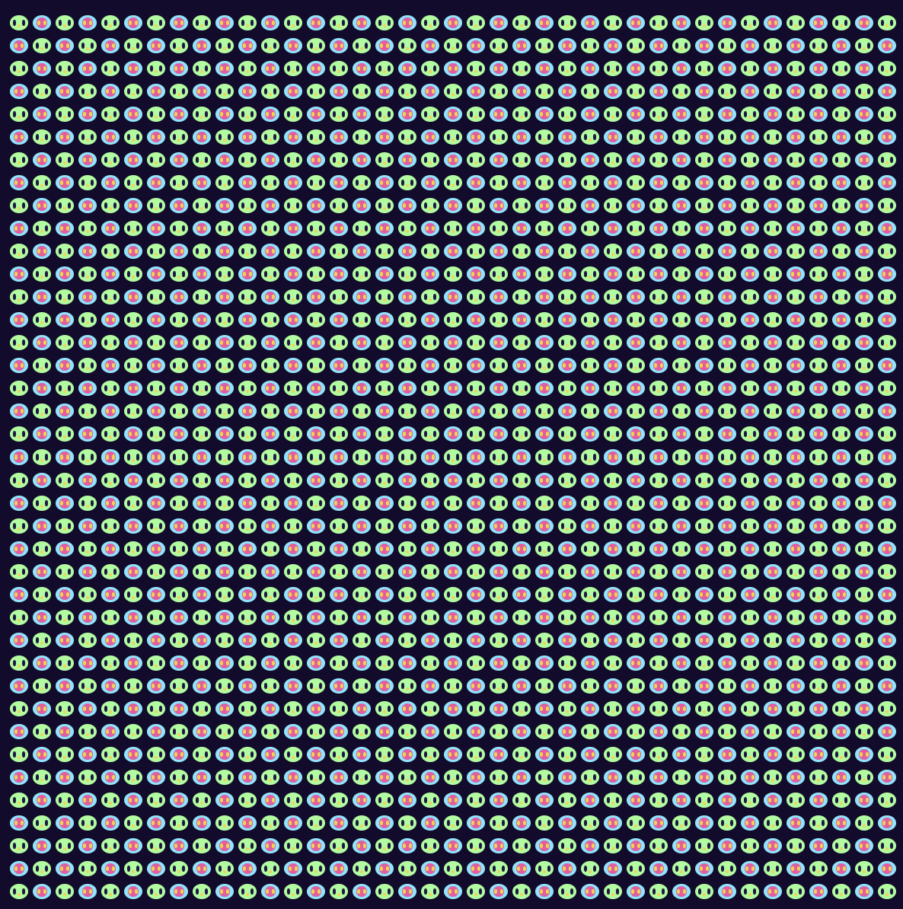

# Juna's CART 253

My project in Creative Computation I is going to be..maybe something more than what I have done in previous years. I have used p5.js before, but this time, I would like to start from the basics and learning from the beginning, because I have already become somewhat familiar with using AI tools.

This website will be a space to document the projects, prototypes, and assignments I create throughout the CART253 course. Rather than simply presenting the final results, I want this website to show the process behind each project, including the approaches I took and the code I used to create them.

## Links
- [Siteinspire](https://www.siteinspire.com/)
- [Reflective journal](journal.md)

## Prototypes
### Aliens

- [Run Prototype](https://june2174.github.io/CART253/tree/main/Assignments/Instructions/prototype1/template-p5-project/)
- [View Code](Assignments/Instructions/prototype1/template-p5-project/js/script.js)

- [Run Prototype](https://june2174.github.io/CART253/tree/main/Assignments/Instructions/prototype2/template-p5-project/)
- [View Code](Assignments/Instructions/prototype2/template-p5-project/js/script.js)

- [Run Prototype](https://june2174.github.io/CART253/tree/main/Assignments/Instructions/prototype3/template-p5-project/)
- [View Code](Assignments/Instructions/prototype3/template-p5-project/js/script.js)